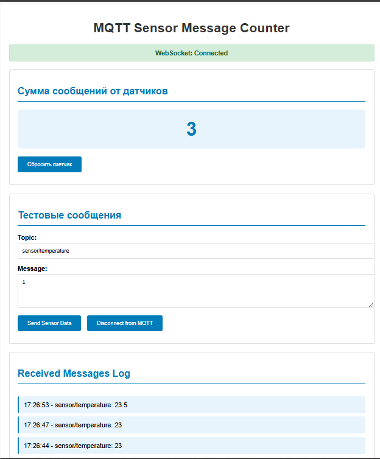

# Урок №7 - IoT и Web, подключаем MQTT (STOMP)

# Настройка брокера для использования протокола MQTT

## Цель:

1. самостоятельно настроить брокер для использования протокола MQTT;
2. написать программу, которая в браузере отобразит, например, сумму количества сообщений пришедших от датчиков по MQTT.

## Описание/Пошаговая инструкция выполнения домашнего задания

1. настроить MQTT в RMQ;
2. настроить MQTT over HTTP;
3. подключиться к брокеру из браузера;
4. установить листенер отображающий сумму.

Задание сдаётся в виде ссылки на pull-request в чат с преподавателем в личном кабинете ОТУС, а не в Telegram

В pull-request должно присутствовать только то, что касается текущей работы.
Временные файлы и файлы IDE не должны попадать в PR.

## Результат выполнения ДЗ

